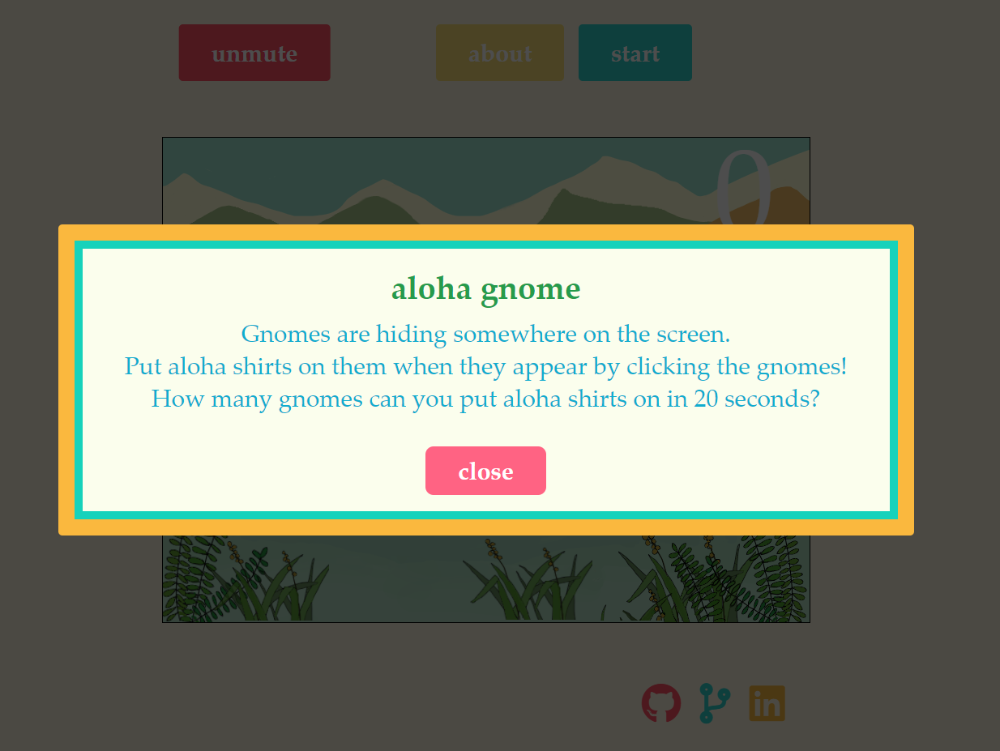
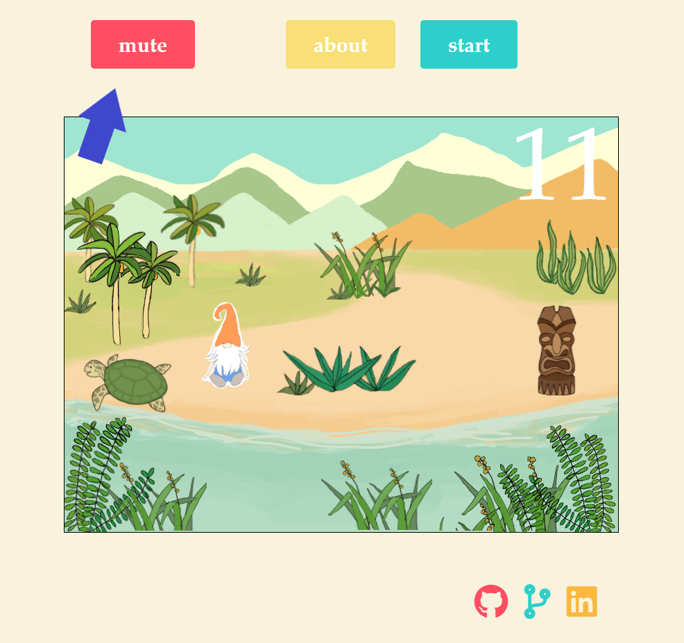
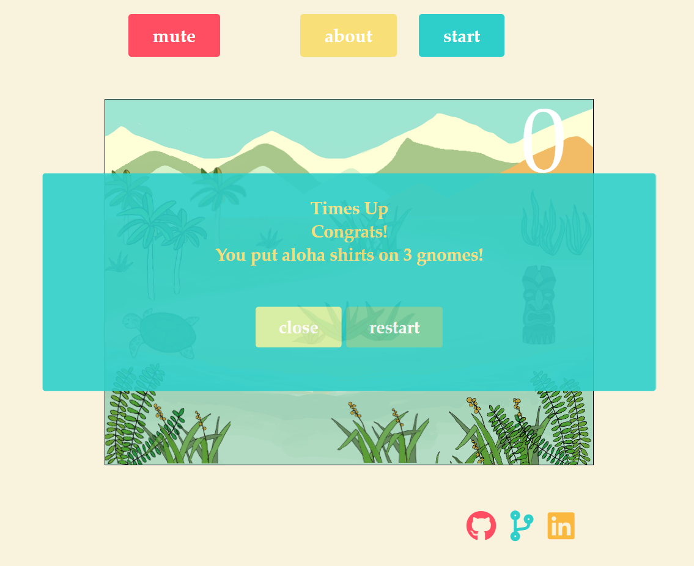

# README

# aloha gnome
[aloha gnome](https://sdean14.github.io/js-aloha-gnome/) whack a mole style game where you put aloha shirts on gnomes as they pop out. 

## Technologies 
* Javascript
* JQuery
* CSS
* HTML

## Rules
Press start button to start playing.
How many gnomes can you put aloha shirts on in 20 seconds?

Press mute button if you like to play quietly.

times up, how many gnomes did you click?

